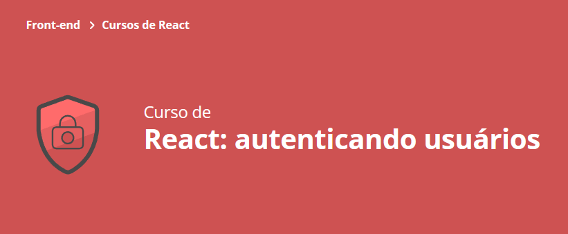

### Aula 1:
- Preparamos o projeto base do Alura Books :white_check_mark:
- Criamos a modal de cadastro do usuário :white_check_mark:
- Transformamos um layout do Figma numa aplicação funcional :white_check_mark:
- Deixamos o formulário pronto para se comunicar com a API :white_check_mark:
### Aula 2:
- Obter um token de autenticação, dada a combinação de usuário e senha :white_check_mark:
- Persistir o token obtido na session storage :white_check_mark:
- A diferença entre local e session storage :white_check_mark:
- Refatorar e encapsular código usando hooks customizados :negative_squared_cross_mark:	(ainda não achei necessário)
### Aula 3:
- 
### Aula 4:
- 
### Aula 5 final:
- 

## 🔨 A saber sobre o projeto
Vamos desenvolver a autenticação do AluraBooks
Nós vamos criar a rotina de cadastro de novos usuários e a autenticação em si. Além disso, vamos aprender a interceptar requisições com o axios, adicionando ao cabeçalho das requisições um token de segurança.
Além de muita mão na massa, vamos entender alguns conceitos importantes que estão relacionado ao nosso dia a dia:
- autenticação
- autorização
- segurança

## ✔️ Técnicas e tecnologias utilizadas
- `React`
- `React Hooks`
- `TypeScript`
- `axios`
- `Session Storage`
- `TSDX`
- `NPM` (no primeiro curso nós criamos uma biblioteca e a publicamos no NPM)
- `Github Actions`

## 🛠️ Abrir e rodar o projeto
Para abrir e rodar o projeto, execute `npm i` para instalar as dependências e `npm start` para inicar o projeto.

## 📚 Mais informações do curso
Busque na plataforma da Alura o curso **React: autenticando usuários** publicado na Escola Frontend.

 

# Getting Started with Create React App

This project was bootstrapped with [Create React App](https://github.com/facebook/create-react-app).

## Available Scripts

In the project directory, you can run:

### `npm start`

Runs the app in the development mode.\
Open [http://localhost:3000](http://localhost:3000) to view it in the browser.

The page will reload if you make edits.\
You will also see any lint errors in the console.

### `npm test`

Launches the test runner in the interactive watch mode.\
See the section about [running tests](https://facebook.github.io/create-react-app/docs/running-tests) for more information.

### `npm run build`

Builds the app for production to the `build` folder.\
It correctly bundles React in production mode and optimizes the build for the best performance.

The build is minified and the filenames include the hashes.\
Your app is ready to be deployed!

See the section about [deployment](https://facebook.github.io/create-react-app/docs/deployment) for more information.

### `npm run eject`

**Note: this is a one-way operation. Once you `eject`, you can’t go back!**

If you aren’t satisfied with the build tool and configuration choices, you can `eject` at any time. This command will remove the single build dependency from your project.

Instead, it will copy all the configuration files and the transitive dependencies (webpack, Babel, ESLint, etc) right into your project so you have full control over them. All of the commands except `eject` will still work, but they will point to the copied scripts so you can tweak them. At this point you’re on your own.

You don’t have to ever use `eject`. The curated feature set is suitable for small and middle deployments, and you shouldn’t feel obligated to use this feature. However we understand that this tool wouldn’t be useful if you couldn’t customize it when you are ready for it.

## Learn More

You can learn more in the [Create React App documentation](https://facebook.github.io/create-react-app/docs/getting-started).

To learn React, check out the [React documentation](https://reactjs.org/).
